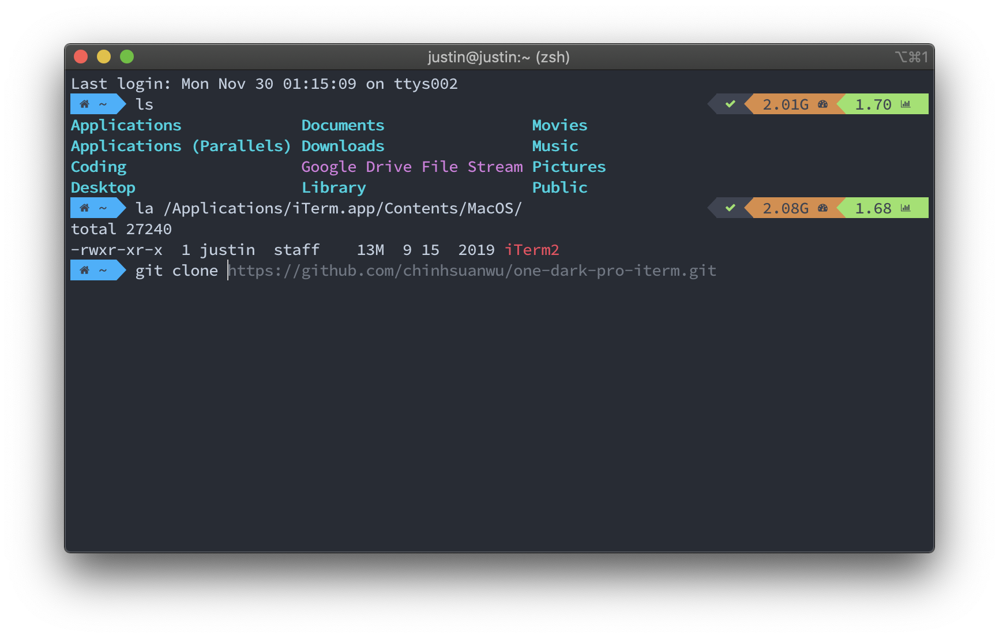

# iTerm2 One Dark Pro Theme

## Overview

[One Dark Pro](https://github.com/Binaryify/OneDark-Pro) theme for [iTerm2](https://iterm2.com).



## Installation
- Download using Git
    ```
    git clone https://github.com/chinhsuanwu/one-dark-pro-iterm.git
    ```
- Download manually the [.zip](https://github.com/chinhsuanwu/one-dark-pro-iterm/archive/master.zip) file.

## Activating theme
- `iTerm2` > `Preferences` > `Profiles` > `Colors`
- Open the `Color Presets...` drop-down in the bottom right corner
- Select `Import...` from the list
- Select the `One Dark Pro.itermcolors` file
- Select the `One Dark Pro` from Color Presets...